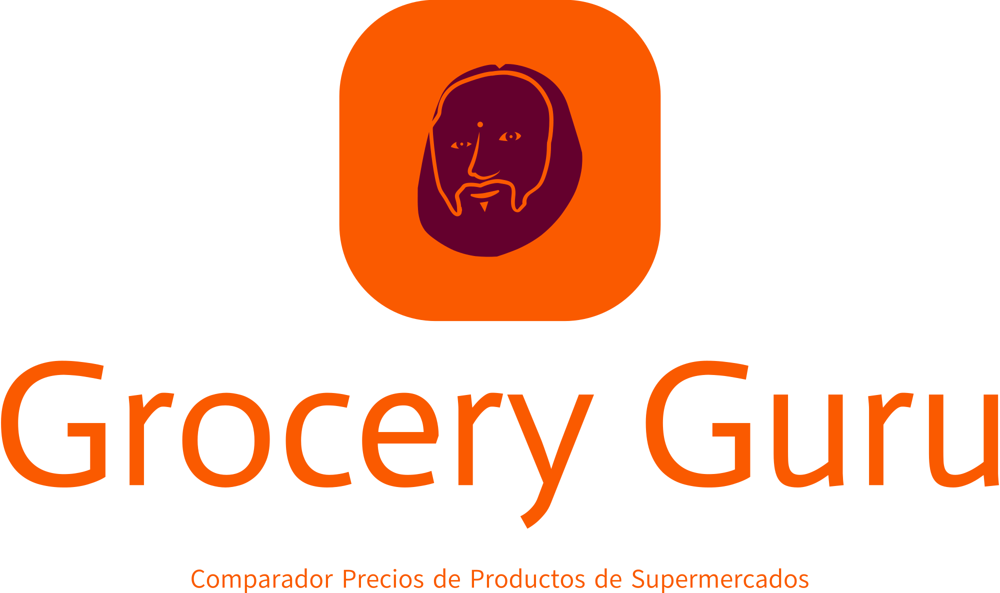

# Grocery Guru: Comparador de Precios de Supermercados

**Proyecto de Prácticas - Ingeniería de Sistemas de Información**  
**Autores**:  
- Rafael Luque Framit - A1  
- Guillermo López Jiménez - A3  

**Enlace a la aplicación web**: [Grocery Guru](https://learned-vault-417715.oa.r.appspot.com/)

---

## Índice
1. [Descripción](#descripción)
2. [Desarrollo](#desarrollo)
3. [Lenguajes y Librerías Utilizadas](#lenguajes-y-librerías-utilizadas)
4. [Modelado de la Integración de Datos](#modelado-de-la-integración-de-datos)
5. [Posibles Mejoras y Actualizaciones](#posibles-mejoras-y-actualizaciones)
6. [Funcionamiento](#funcionamiento)
7. [Bibliografía](#bibliografía)

---

## Descripción

Grocery Guru es una aplicación web diseñada para comparar precios de productos en diferentes supermercados de manera eficiente. Proporciona a los usuarios herramientas para:
- Comparar precios según el supermercado.
- Ordenar productos de menor a mayor precio.
- Ordenar productos de mayor a menor precio.

### Fuentes de datos utilizadas:
1. **Web scraping**: Supermercados **DIA** y **Amazon**.
2. **API Open Food**: Información nutricional y detalles de reciclaje de productos.

### Limitaciones encontradas:
- **Supermercados rechazados**: Carrefour, Alcampo y Aldi detectaron el comportamiento de web scraping.
- **Problemas con Hipercor**: Aunque funciona en local, no es compatible con Google Cloud debido a errores en la librería Playwright.

---

## Desarrollo

### Estructura del proyecto:
1. **Archivo `main.py`**:  
   Controla la búsqueda, ordenación e impresión de productos, utilizando Flask para desplegar la aplicación.

2. **Archivo `Producto.py`**:  
   Clase que define los atributos del producto (nombre, precio, enlace, supermercado, logo e imagen).

3. **Archivo `scraper.py`**:  
   Funciones para extraer información de las webs de los supermercados mediante web scraping.

4. **Archivo `apiOF.py`**:  
   Maneja las peticiones HTTP y el análisis de respuestas JSON de la API Open Food.

5. **Archivo `busquedaCompleta.py`**:  
   Combina los datos extraídos por el scraper y la API en una lista unificada.

6. **Frontend**:  
   - `index.html`: Contenido y estructura básica de la página.  
   - `styles.css`: Estilo y diseño visual de la web.

---

## Lenguajes y Librerías Utilizadas

### Lenguajes:
- **HTML** y **CSS**: Para el desarrollo del frontend.
- **Python**: Backend y manejo de datos.

### Librerías principales:
- **Flask**: Framework para aplicaciones web.
- **BeautifulSoup**: Web scraping para supermercados como DIA y Amazon.
- **Playwright**: Web scraping en Hipercor (limitado a entornos locales).
- **Requests**: Manejo de peticiones HTTP.
- **Jinja**: Renderizado dinámico en Flask.

---

## Modelado de la Integración de Datos

Los datos de las distintas fuentes se unifican en la clase `Producto`, que incluye:
- **Atributos**:  
  - Nombre del producto.  
  - Precio.  
  - URL al producto.  
  - Supermercado de origen.  
  - Logo del supermercado.  
  - Imagen del producto.  

### Fuentes de datos:
| Clase         | Hipercor           | Dia                          | Amazon              | API Open Food      |
|---------------|--------------------|-----------------------------|---------------------|--------------------|
| **Nombre**    | product_tile-desc  | search-product-card__name   | title-recipe        | product_name       |
| **Precio**    | prices-price       | search-product-card-unit    | a-price             | No disponible      |
| **Imagen**    | js-product-link    | search-product-card__image  | s-image             | image_front_url    |

---

## Posibles Mejoras y Actualizaciones

1. **Ampliar fuentes de datos**: Añadir más supermercados mediante web scraping o APIs adicionales.  
2. **Información complementaria**: Incluir detalles como alérgenos, información nutricional y opiniones de usuarios.  
3. **Mejoras en la interfaz de usuario**: Desarrollar un diseño más profesional e intuitivo.

---

## Funcionamiento

1. **Navegación inicial**:  
   - Al acceder a la aplicación, se presenta una barra de búsqueda donde los usuarios pueden escribir el producto deseado.
   - Se selecciona el orden de los productos (por defecto: DIA > Amazon > Open Food).

2. **Resultados de búsqueda**:  
   Para cada producto se muestra:  
   - Nombre.  
   - Precio.  
   - Supermercado de origen.  
   - Enlace al producto en la página oficial.  
   - Imagen del producto.  
   - Logo del supermercado.

3. **Ordenación**:  
   Los usuarios pueden reordenar los resultados según sus preferencias.

---

## Bibliografía

1. [Slides sobre Integración de Datos - UGR](https://elvex.ugr.es/decsai/information-systems/slides/40%20Data%20Integration.pdf)  
2. [Tutorial sobre Flask](https://elvex.ugr.es/decsai/information-systems/slides/P1%20Python%20Flask.pdf)  
3. [Errores comunes en Google Cloud y Playwright](https://stackoverflow.com/questions/73171905/chromium-executable-doesnt-exist-for-running-playwright-within-a-deployed-googl)  
